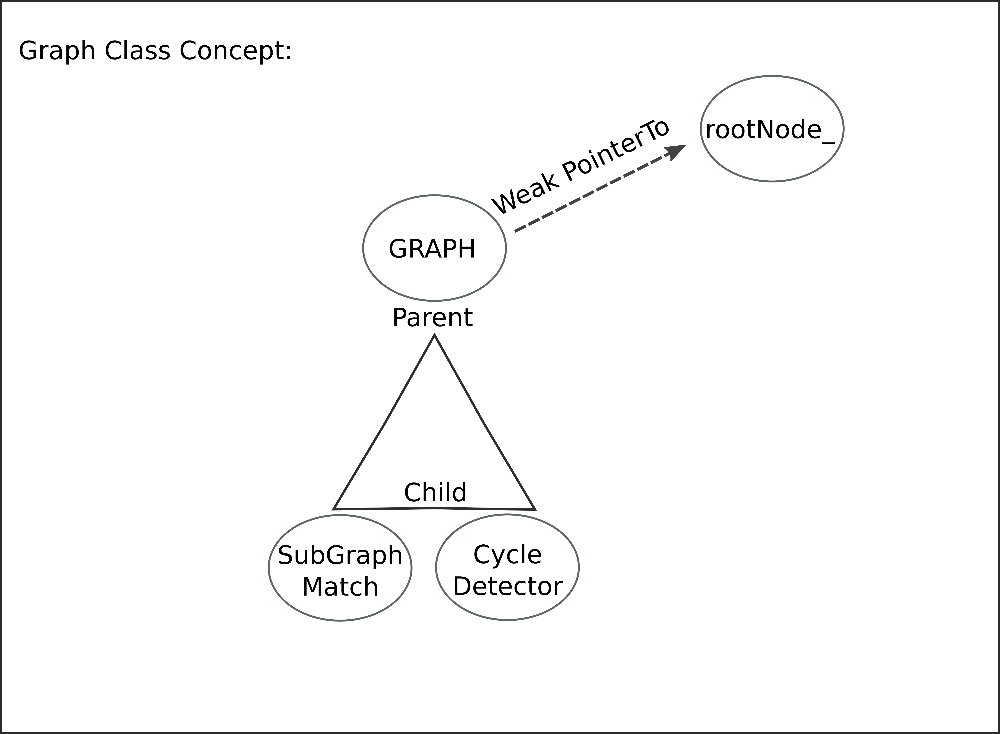
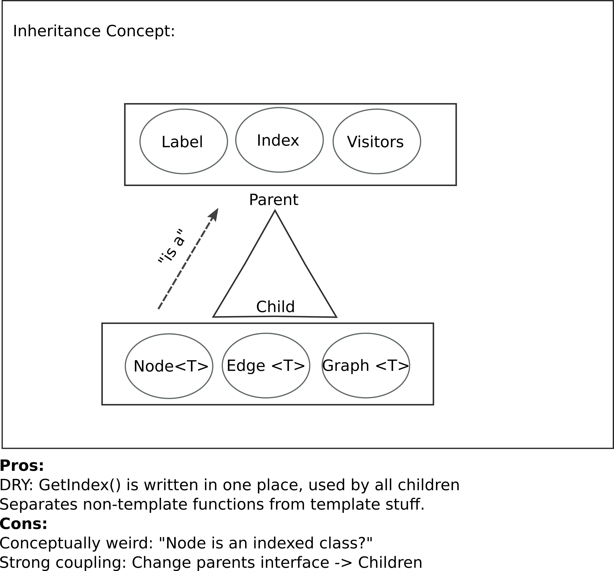
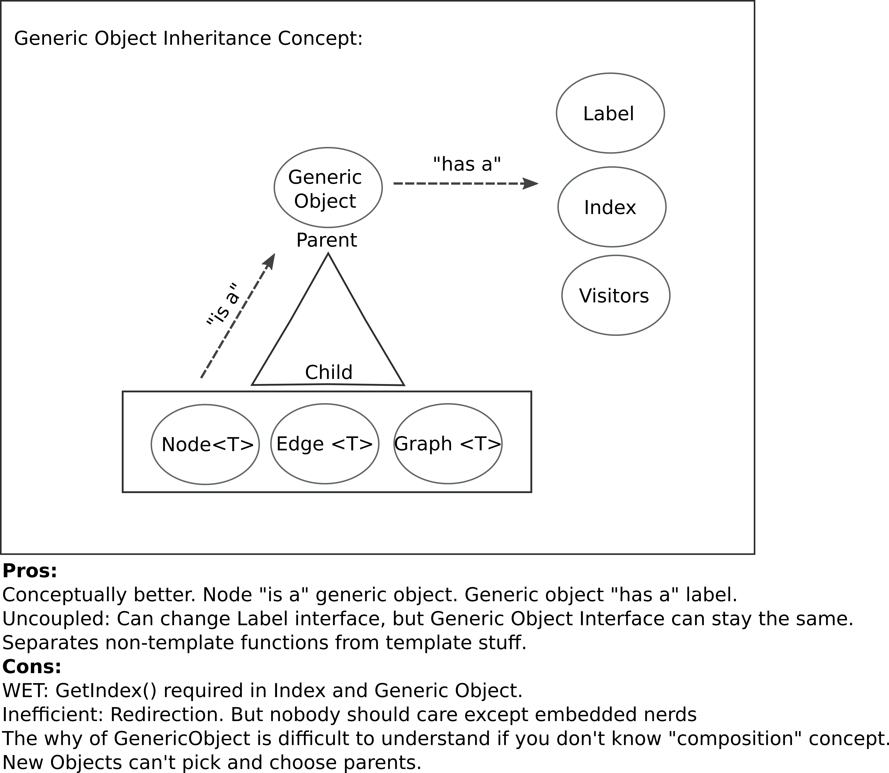

# Template Graph Class
Uses Templates in C++. The design goals are:
	Allows to make graphs for any type (int, string, Atom class, residue class, Graph!). 
	Uses smart pointers to avoid memory leaks and provide ownership.
	Nodes and edges can be cleanly deleted. You can delete a node and all associated edges will be removed automagically.
	Node and Edge classes are independant of Graph.
	Graph class uses Node's interface.

## Schematic

## GraphClassConcept

## Interitance Concept

This inheritance concept was replaced by:
## Generic Object Interitance Concept

### Notes
Project is under development as of Sept 2020, contact olgrant "at" uga.edu with queries. 
Written by Oliver Grant as he learned how to use templates, smart pointers and some OOP concepts.
Has been tested on linux, but should work on both Mac and Windows with appropriate C++ complilers.

### Compilation
See compiling.sh, or just run that file.

### Usage
See testDriver.cpp for examples

